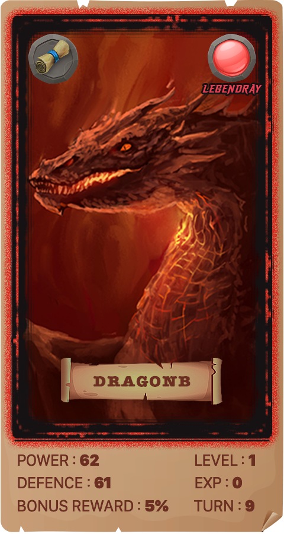

Three different arena modes for you to fight against opponents of different levels:

 Main battlefield (only 1-20 cards are allowed to participate in the battle)

Intermediate battlefield (only cards of level 21-40 are allowed to participate in the battle)

Advanced battlefield (only 41-60 cards are allowed to participate in the battle).

------

 

*The higher the league level, the better the rewards.

*The main battlefield consumes 500 MEMP per challenge.

*The intermediate battlefield consumes 1000 MEMP per challenge.

*Each challenge on the advanced battlefield consumes 1500 MEMP.

------

 

Players will choose 1 NFT card from their favorite cards to fight their opponents. The winner is determined based on the card statistics of the player and the BOSS. Different arenas will determine players will receive different rewards:

 Main battlefield: When MEMP is consumed, 1 wooden treasure chest will be dropped, and there is a chance to drop 1 silver treasure chest.

 Intermediate battlefield: When MEMP is consumed, 1 silver treasure chest will be dropped, and there is a chance to drop 1 golden treasure chest.

 Advanced battlefield: When MEMP is consumed, a golden treasure chest will be dropped, and there is a certain chance to drop a rare diamond treasure chest.

------

 

 

If your card wins, you will get a treasure chest reward. On the contrary, if you lose, the reward will be automatically sent to Burning Wallet.

