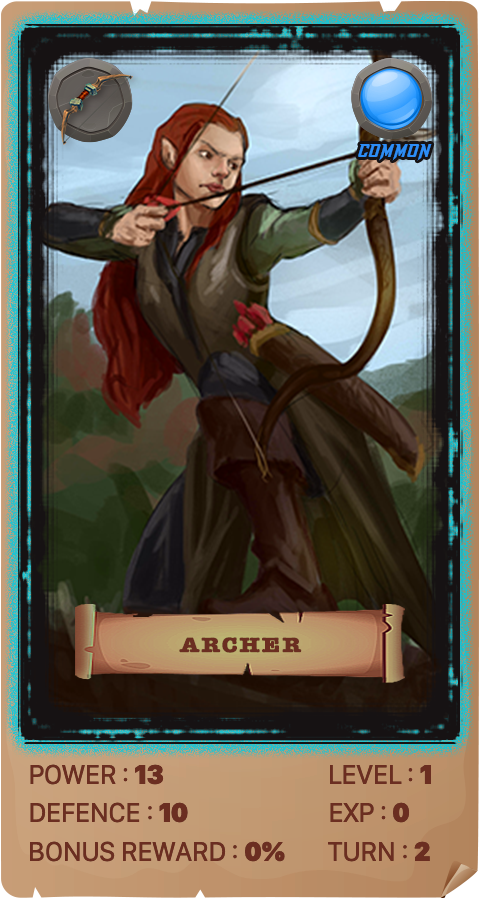

There are four different faction characters. These four faction characters restrain each other and can increase the winning rate of the restraining side in PVP battles.

------

 

The following table is the content of restraint of different camps:

 

| COUNTER       | VS   | COUNTER       | RESULT           |
| ------------- | ---- | ------------- | ---------------- |
| Holy Archer   | VS.  | Knight        | Holy Archer+5%   |
| Knight        | VS.  | Pharmaceutist | Knight+5%        |
| Pharmaceutist | VS.  | Magician      | Pharmaceutist+5% |
| Magician      | VS.  | Holy Archer   | Magician+5%      |

